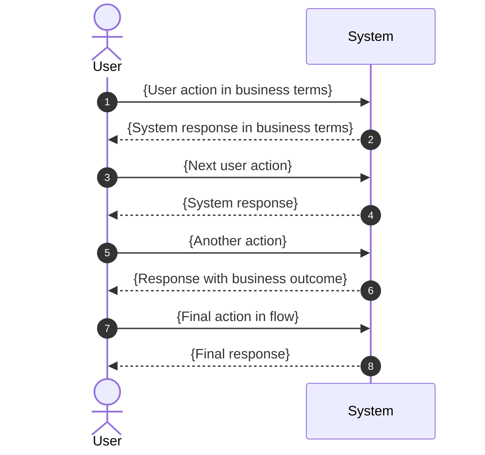

# Functional Summary - {Feature Name}

**Module**: `{module-name}`
**AOS Version**: {version}

## Business Objectives

- {Objective 1 - what business value does this provide}
- {Objective 2 - what can users accomplish}
- {Objective 3 - what problem does this solve}
- {Objective 4 - what improvement does this bring}

---

## Scope

| In Scope | Out of Scope |
|----------|--------------|
| {Feature 1 included} | {Feature 1 explicitly excluded} |
| {Feature 2 included} | {Feature 2 explicitly excluded} |
| {Feature 3 included} | {Feature 3 explicitly excluded} |
| {Feature 4 included} | {Future consideration} |
| {Feature 5 included} | |

---

## Main Flow - {Primary Use Case Name}



---

## Workflow Overview

```mermaid
flowchart LR
    A[{Stage 1\nName}] --> B[{Stage 2\nName}]
    B --> C[{Stage 3\nName}]
    C --> D[{Stage 4\nName}]
    D --> E[{Stage 5\nName}]
```

---

## {Detailed Workflow Name} - User Actions

```mermaid
flowchart TB
    subgraph trigger [Trigger]
        A[{Triggering event}]
    end

    subgraph actions [Available Actions]
        B[{Action 1}]
        C[{Action 2}]
        D[{Action 3}]
    end

    subgraph results [System Response]
        E[{Result of Action 1}]
        F[{Result of Action 2}]
        G[{Result of Action 3}]
        H[{Common outcome}]
    end

    A --> actions
    B --> E
    C --> F
    D --> G
    F --> H
    G --> H
```

**IMPORTANT**: Always use subgraphs to prevent crossing arrows. Flow must be top-to-bottom only.

---

## Business Constraints

| Constraint | Description | Business Impact |
|------------|-------------|-----------------|
| **{Constraint 1 name}** | {Complete explanation of what the constraint is and when it applies. Be specific about conditions.} | {Impact on users. What happens if constraint is violated? What workarounds exist?} |
| **{Constraint 2 name}** | {Full description of the limitation or requirement.} | {Business consequence and user guidance.} |
| **{Constraint 3 name}** | {Detailed explanation of the constraint.} | {How this affects daily operations.} |
| **{Constraint 4 name}** | {What is restricted and why.} | {User impact and recommended approach.} |
| **{Constraint 5 name}** | {Complete constraint description.} | {Business impact statement.} |

---

## Business Rules

| Rule | Trigger | Behavior |
|------|---------|----------|
| **{Rule 1 name}** | {Event that activates this rule} | {Detailed description of what the system does. Include the logic, any conditions, and the outcome. At least 2-3 sentences.} |
| **{Rule 2 name}** | {When does this apply} | {Complete explanation of the system behavior. Include formula if applicable, conditions, and results.} |
| **{Rule 3 name}** | {Triggering event} | {Full description of the automatic behavior. What inputs are used, what calculations occur, what outputs are produced.} |
| **{Rule 4 name}** | {Activation condition} | {Detailed behavior description including any cascading effects or related updates.} |
| **{Rule 5 name}** | {When triggered} | {Comprehensive explanation of the rule execution and its effects on related data.} |
| **{Rule 6 name}** | {Any modification} | {Description of synchronization or update behavior that occurs across the system.} |

---

## AOS Integration Points

| Functional Capability | Usage in this Feature |
|-----------------------|-----------------------|
| {Capability 1 - business name} | {How this capability is used in functional terms. No class names.} |
| {Capability 2 - business name} | {Functional description of usage.} |
| {Capability 3 - business name} | {Business explanation of how this is leveraged.} |
| {Capability 4 - business name} | {Functional usage description.} |
| {Capability 5 - business name} | {How this integrates with the feature.} |

**IMPORTANT**: Use functional capability names only. Examples:
- "Parent-child line hierarchy" NOT "SaleOrderLine.parentSaleOrderLine"
- "Price list management" NOT "PriceListService"
- "Line computation engine" NOT "SaleOrderLineComputeService"

---

## References

- Detailed specifications: `{path-to-detailed-specifications.md}`
