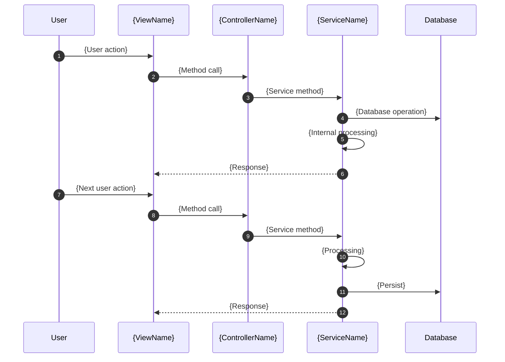

# Architecture Summary - {Feature Name}

**Module**: `{module-name}`
**Main Dependency**: `{primary-aos-module}`

## Functional Objective

{Brief description of what the feature does - 3 lines maximum. Focus on business value, not technical implementation.}

---

## Domain Model

```mermaid
classDiagram
    direction TB

    class {ExistingEntity1} {
        <<AOS - {module}>>
        +{relationField}: {NewEntity}[*]
    }

    class {NewEntity1} {
        <<New - {Type}>>
        +{field1}: {Entity}
        +{field2}: {Type}
        +{field3}: {Type}
    }

    class {ExistingEntity2} {
        <<AOS - {module}>>
        +{newField}: {NewEntity}[*]
        +{extensionField}: {Type}
    }

    class {NewEntity2} {
        <<New - {Type}>>
        +{field1}: {Entity}
        +{field2}: {Type}
        +{field3}: {Type}
    }

    {ExistingEntity1} "1" --> "*" {NewEntity1} : {relationName}
    {NewEntity1} "*" --> "1" {ExistingEntity1} : {backRef}
    {ExistingEntity2} "1" --> "*" {NewEntity2} : {relationName}
```

**Key Design Pattern**:
- `{NewEntity1}` = {description of role/purpose}
- `{NewEntity2}` = {description of role/purpose}

---

## Main Flow - {Primary Use Case Name}



---

## AOS Integrations - Service Flow

```mermaid
flowchart LR
    subgraph Module {moduleName}
        CTRL[{ControllerName}]
        SVC[{ServiceName}]
    end

    subgraph AOS {aosModule1}
        AOS_SVC1[{AOSService1}]
        AOS_SVC2[{AOSService2}]
        AOS_ENTITY[{AOSEntity}]
    end

    subgraph AOS {aosModule2}
        AOS_SVC3[{AOSService3}]
        AOS_ENTITY2[{AOSEntity2}]
    end

    CTRL -->|calls| SVC
    SVC -->|{operation1}| AOS_SVC1
    SVC -->|{operation2}| AOS_SVC2
    AOS_SVC2 -->|persists| AOS_ENTITY
    SVC -->|{operation3}| AOS_SVC3
```

**Extension Points**:
- `{Entity1}.xml` and `{Entity2}.xml` extended via `extension="true"`
- Views extended by XPath `<extend target="...">`

---

## Module Structure

```
{webapp-root}/modules/{module-name}/
|
+-- build.gradle
|
+-- src/
    +-- main/
        +-- java/
        |   +-- com/
        |       +-- axelor/
        |           +-- apps/
        |               +-- {modulepackage}/
        |                   +-- db/
        |                   |   +-- repo/
        |                   |       +-- {CustomRepo}.java (if custom methods needed)
        |                   |
        |                   +-- exception/
        |                   |   +-- {Module}ExceptionMessage.java
        |                   |
        |                   +-- module/
        |                   |   +-- {Module}Module.java (extends AxelorModule - auto-discovered)
        |                   |
        |                   +-- service/
        |                   |   +-- {Service1}.java
        |                   |   +-- {Service1}Impl.java
        |                   |   +-- {Service2}.java
        |                   |   +-- {Service2}Impl.java
        |                   |
        |                   +-- web/
        |                       +-- {Controller1}.java
        |                       +-- {Controller2}.java
        |
        +-- resources/
            +-- domains/
            |   +-- {NewEntity1}.xml
            |   +-- {NewEntity2}.xml
            |   +-- {ExtendedEntity1}.xml (extension)
            |   +-- {ExtendedEntity2}.xml (extension)
            |
            +-- views/
            |   +-- {NewEntity1}.xml
            |   +-- {NewEntity2}.xml
            |   +-- {ExtendedEntity1}.xml (extension)
            |   +-- {ExtendedEntity2}.xml (extension)
            |
            +-- i18n/
                +-- messages.properties
                +-- messages_fr.properties
```

**IMPORTANT**: This structure must be extracted EXACTLY from the source architecture document. Do not simplify or modify.

---

## References

- Detailed architecture: `{path-to-architecture-plan.md}`
