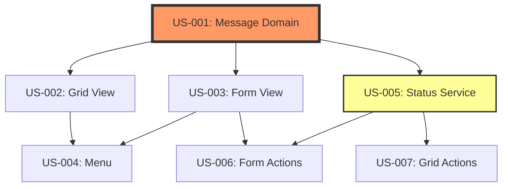

# US Dependency Mapper Skill

Systematically identifies and maps dependencies between User Stories in Axelor projects.

## Purpose

This skill helps identify:
- **Technical dependencies**: One US requires another to be completed first (domain before views)
- **Functional dependencies**: Related features must exist for integration
- **Logical dependencies**: Business process order requirements
- **Blocking relationships**: Critical path analysis

## Usage

**Input**: List of User Stories with descriptions and technical details
**Output**: Dependency graph, blocking relationships, and recommended implementation order

---

## Dependency Types

### 1. Technical Dependencies

**Definition**: One component must exist before another can be implemented.

**Common patterns**:

| Dependency | Reason | Example |
|------------|--------|---------|
| Domain → Grid View | Grid displays domain fields | US-001 (Message domain) → US-002 (Message grid) |
| Domain → Form View | Form edits domain fields | US-001 (Message domain) → US-003 (Message form) |
| Views → Menu | Menu opens views | US-002, US-003 → US-004 (Menu entry) |
| Domain → Service | Service operates on domain | US-001 (Customer domain) → US-010 (Customer service) |
| Service → Controller | Controller calls service | US-010 (Service) → US-011 (Controller) |
| Entity A → Entity B | B references A as FK | US-005 (Company domain) → US-001 (Customer domain with company FK) |

**Identification rule**: Check technical details section for entity/view/service references.

**Example**:
```
US-002: Create Message Grid View
Technical Details:
  - Displays columns from Message entity

→ Depends on: US-001 (Message domain must exist)
```

---

### 2. Functional Dependencies

**Definition**: A feature requires another feature to be complete for business integration.

**Common patterns**:

| Dependency | Reason | Example |
|------------|--------|---------|
| Parent Feature → Child Feature | Child extends parent | US-020 (Email viewing) → US-025 (Email replying) |
| Core CRUD → Advanced Features | Advanced needs base | US-003 (Customer form) → US-015 (Customer import) |
| Data Entry → Reporting | Reports need data | US-010 (Sale order entry) → US-050 (Sales dashboard) |
| Master Data → Transactional | Transactions use master | US-005 (Product catalog) → US-020 (Order lines) |

**Identification rule**: Check acceptance criteria for references to other features.

**Example**:
```
US-025: Implement Email Reply Function
Acceptance Criteria:
  - Reply button visible when viewing email
  - Email body quoted in reply

→ Depends on: US-003 (Email detail view must exist)
→ Depends on: US-030 (Email composition service must exist)
```

---

### 3. Logical Dependencies

**Definition**: Business process or workflow requires features in specific order.

**Common patterns**:

| Dependency | Reason | Example |
|------------|--------|---------|
| Authentication → Authorization | Auth before access control | US-100 (Login) → US-101 (Permissions) |
| Create → Approve → Process | Workflow sequence | US-200 (Create PO) → US-201 (Approve PO) → US-202 (Process PO) |
| Import → Validate → Transform | Data pipeline | US-300 (Import CSV) → US-301 (Validate data) → US-302 (Transform) |

**Identification rule**: Check workflow or business process description.

**Example**:
```
US-201: Implement Purchase Order Approval
Business Logic:
  - Order must be in "Submitted" status
  - Only managers can approve

→ Depends on: US-200 (PO creation sets "Draft" status)
→ Depends on: US-205 (Status workflow transitions)
```

---

### 4. Blocking Dependencies

**Definition**: Critical User Stories that block multiple downstream stories.

**Identification**: User Stories with 3+ dependencies pointing to them.

**Example**:
```
US-001: Define Message Domain

Blocks:
  - US-002 (Grid view)
  - US-003 (Form view)
  - US-010 (Status service)
  - US-015 (Attachment service)

→ CRITICAL PATH: Must be completed early
```

---

## Dependency Identification Process

### Step 1: Extract Technical Components

For each User Story, extract from "Technical Details" section:

- **Entities used**: Which domain entities are referenced?
- **Views needed**: Which views are required to exist?
- **Services called**: Which services are invoked?
- **Repositories queried**: Which data access is needed?

**Example extraction**:

```
US-010: Implement Customer Search Service

Technical Details:
  - Service: CustomerService
  - Methods: searchCustomers(criteria) → List<Customer>
  - Entities: Customer (domain), Company (for filtering)
  - Repositories: CustomerRepository, CompanyRepository

Components identified:
  - Needs: Customer domain (US-001)
  - Needs: Company domain (US-005)
  - Needs: CustomerRepository (created with US-001)
  - Creates: CustomerService.searchCustomers()
```

### Step 2: Map Entity Dependencies

Create entity dependency map:

```
Company (US-005)
  ↓
Customer (US-001) [references Company]
  ↓
SaleOrder (US-020) [references Customer]
  ↓
SaleOrderLine (US-021) [references SaleOrder]
```

**Rule**: If Entity B has a relationship to Entity A, then US(B) depends on US(A).

### Step 3: Map View Dependencies

Create view dependency map:

```
Domain (US-001)
  ├→ Grid View (US-002)
  ├→ Form View (US-003)
  └→ Service (US-010)
       └→ Controller (US-011)
            └→ Action Buttons (US-012)
```

**Rule**: Views depend on domain, actions depend on services, services depend on domain.

### Step 4: Map Feature Dependencies

Identify logical feature order:

```
Feature: Customer Management
  1. US-001: Domain
  2. US-002, US-003: Views (parallel)
  3. US-004: Menu (depends on views)
  4. US-010: Search service
  5. US-015: Import feature (depends on domain + service)
  6. US-020: Export feature (depends on domain + service)
  7. US-025: Dashboard (depends on all above)
```

### Step 5: Identify Critical Path

Find US with most blocking dependencies:

```
Critical Path Analysis:

US-001 (Customer domain) blocks 6 stories → **START HERE**
US-010 (CustomerService) blocks 3 stories → **HIGH PRIORITY**
US-003 (Customer form) blocks 2 stories → **MEDIUM PRIORITY**
```

---

## Dependency Notation

### Standard Format

```textile
h4. Dependencies

* Depends on: US-XXX ([Entity/Component] required)
* Depends on: US-YYY ([Feature] must be complete)
* Blocks: US-ZZZ (This US must be done before)
* Blocks: US-AAA, US-BBB (Multiple stories blocked)
```

### With Reasoning

```textile
h4. Dependencies

* Depends on: US-001 (Message domain must exist to create grid view)
* Depends on: US-005 (EmailAccount entity needed for relationship)
* Blocks: US-010 (Status service requires domain fields)
* Blocks: US-015 (Attachment feature needs message entity)
```

---

## Dependency Graph Formats

### Textual Format

```
US-001 (Message Domain)
  ├─→ US-002 (Grid View)
  ├─→ US-003 (Form View)
  │   └─→ US-006 (Form Actions)
  ├─→ US-004 (Menu)
  └─→ US-005 (Status Service)
      ├─→ US-007 (Grid Actions)
      └─→ US-008 (Form Buttons)
```

### Table Format

| US ID | Title | Depends On | Blocks | Priority |
|-------|-------|------------|--------|----------|
| US-001 | Message Domain | (none) | US-002, US-003, US-005 | **CRITICAL** |
| US-002 | Grid View | US-001 | US-004 | High |
| US-003 | Form View | US-001 | US-004, US-006 | High |
| US-004 | Menu Entry | US-002, US-003 | (none) | Medium |
| US-005 | Status Service | US-001 | US-007, US-008 | High |
| US-006 | Form Actions | US-003, US-005 | (none) | Medium |

### Mermaid Diagram Format



---

## Implementation Order Recommendation

### Strategy 1: Depth-First (Feature Complete)

Complete one feature fully before moving to next.

**Pattern**:
```
1. US-001 (Domain)
2. US-002 (Grid)
3. US-003 (Form)
4. US-004 (Menu)
5. US-005 (Service)
6. US-006 (Actions)

→ Customer management feature 100% complete before next feature
```

**Pros**: Delivers complete business value incrementally
**Cons**: May delay parallel development

**Use when**: Small team (1-2 devs) or high integration risk

---

### Strategy 2: Breadth-First (Infrastructure Layer)

Complete all domains, then all views, then all services.

**Pattern**:
```
Sprint 1: All domains (US-001, US-010, US-020)
Sprint 2: All views (US-002, US-003, US-011, US-012)
Sprint 3: All services (US-005, US-015, US-025)
```

**Pros**: Enables parallel development
**Cons**: Delays complete business value

**Use when**: Large team (3+ devs) with clear expertise areas

---

### Strategy 3: Critical Path (Unblock Early)

Complete blocking US first to unblock maximum downstream work.

**Pattern**:
```
1. US-001 (blocks 5 stories) → **DO FIRST**
2. US-005 (blocks 3 stories) → **DO SECOND**
3. US-002, US-003 (parallel, each blocks 1) → **DO THIRD**
4. US-004, US-006, US-007 (parallel, no blocks) → **DO LAST**
```

**Pros**: Maximizes parallel work opportunities
**Cons**: May not deliver feature in logical order

**Use when**: Optimizing for shortest project duration

---

## Dependency Validation Checklist

Before finalizing dependencies:

- [ ] **Circular dependencies**: Check for A→B→A cycles (invalid)
- [ ] **Missing dependencies**: All technical components declared
- [ ] **Over-dependencies**: Avoid creating false dependencies
- [ ] **Orphan stories**: All US have at least one dependency or dependent
- [ ] **Critical path**: Identified and marked
- [ ] **Parallel opportunities**: Noted which US can be done simultaneously

---

## Circular Dependency Detection

### Invalid Pattern (Circular)

```
US-001 depends on US-002
US-002 depends on US-003
US-003 depends on US-001  ← CIRCULAR!
```

**Solution**: Break the cycle by splitting or reordering.

### Valid Pattern (Acyclic)

```
US-001 (Domain) → US-002 (Grid) → US-004 (Menu)
US-001 (Domain) → US-003 (Form) → US-004 (Menu)
```

---

## Parallel Execution Identification

Identify US with no inter-dependencies:

```
After US-001 (Domain) completes:

Parallel Group 1:
  - US-002 (Grid)
  - US-003 (Form)
  - US-005 (Service)
  → Can be developed simultaneously by 3 developers

After Group 1 completes:

Parallel Group 2:
  - US-004 (Menu) - depends on US-002, US-003
  - US-006 (Actions) - depends on US-003, US-005
  → Can be developed by 2 developers
```

---

## Dependency Output Example

### For Single US

```textile
h3. US-005: Implement Message Status Service Logic

[... user story content ...]

h4. Dependencies

* Depends on: US-001 (Message domain must exist - service operates on Message entity)
* Depends on: US-010 (EmailAccount entity required for permission validation)
* Blocks: US-007 (Grid actions need service.markAsRead() method)
* Blocks: US-008 (Form button needs service.markAsUnread() method)
```

### For Complete EPIC

```textile
h2. EPIC-001 Dependency Map

h3. Critical Path

US-001 (Message Domain) → **CRITICAL START**
  Blocks: 5 downstream stories
  Must complete: Sprint 1, Day 1

US-010 (EmailAccount Domain) → **CRITICAL START**
  Blocks: 3 downstream stories (including US-001)
  Must complete: Sprint 1, Day 1 (parallel with US-001)

h3. Dependency Graph

```
US-010 (EmailAccount)
  ↓
US-001 (Message Domain)
  ├─→ US-002 (Grid) ────────┐
  ├─→ US-003 (Form) ────────┤
  ├─→ US-005 (Service) ──┐  │
  │                      │  │
  │                      ├──┼─→ US-007 (Grid Actions)
  │                      │  │
  │                      └──┼─→ US-008 (Form Buttons)
  │                         │
  └─────────────────────────┴─→ US-004 (Menu)
```

h3. Recommended Implementation Order

*Sprint 1: Foundation (Week 1)*
1. US-010: EmailAccount Domain (parallel)
2. US-001: Message Domain (parallel)
3. US-002: Message Grid View
4. US-003: Message Form View
5. US-005: Status Service

*Sprint 2: Integration (Week 2)*
6. US-007: Grid Actions (parallel)
7. US-008: Form Buttons (parallel)
8. US-004: Menu Entry

h3. Parallel Execution Opportunities

Week 1:
  - US-010 + US-001 (2 devs)
  - US-002 + US-003 + US-005 (3 devs) - after US-001 completes

Week 2:
  - US-007 + US-008 (2 devs)
  - US-004 (1 dev) - after all complete
```

---

## Reference

See [Dependency Patterns](reference/dependency-patterns.md) for common scenarios.

## Related Skills

- [Epic Estimator](../epic-estimator/SKILL.md)
- [US Quality Validator](../us-quality-validator/SKILL.md)

## Related Documents

- [EPIC Generation Workflow](../../docs/workflows/epic-generation-workflow.md)
